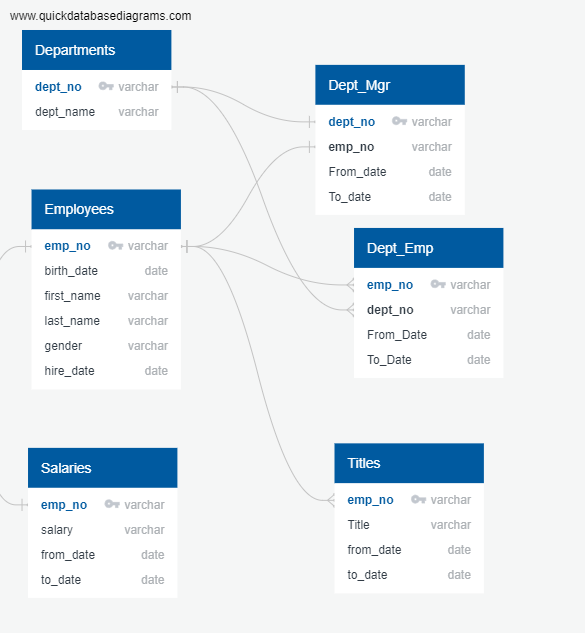

# Pewlett-Hackard-Analysis
Management at Pewlett Hackard would like to assess the population of employees that will begin to retire and the positions that will become available due to the retirees. Using the data provided I was able to build a query that returned the list of employees that fit the retirement criteria. This assessment allows PH to prepare in advance for the vacancies in the near future. 
The data for PH is dispersed and stored in multiple tables. In order to combine parts of each table to tell the bigger story I began with building an ERD to determine the relations of each table. An ERD is a useful blueprint that helps during the selection process of what fields I would need and from where (see image 1 below). 

**Image 1:** ERD

After reviewing the report requirements, I created the tables with the appropriate foreign and primary keys. Using those tables I built select statements to query a report between multiple tables using joins to merge multiple datasets. The challenge that was faced in merging the dataset was during the validation of the report where I came across irrelevant duplicates on the employee id. The report required a count on the eligible retirees and their recent title, however the query was returning duplicates showing the title changes each employee has encountered. In order to eliminate the historical titles for each employee the Partitioning method was required. Another objective of PH was to assess the population of employees eligible for the mentorship program, to do so I analyzed the relation between the tables and assessed that a left join was necessary for this query rather than an inner join. To validate my method I performed a vlookup in the original titles csv file against the employees file where I brought in the birthdate from employees and performed a filter on the birth date column to year 1965 and the to_date column to year “9999” for active employees. The results outputted 1,549 rows of eligible employees with no duplicates and this population matched the query output. 

For Technical Deliverable 1 (latest_titles) the output resulted in 33,118 eligible employees that were approaching retirement. The output lets us know the size of the organization that will face a shift in roles however from the financial aspect the cost of replacing these employees has not been identified yet. I would recommend a deeper dive into the salaries and titles that need to be replaced and analyze the roles that either are no longer needed or those that can be transformed to a new role. For Technical Deliverable 2 (mentors_list) 1,549 employees were eligible to participate in the mentorship program. The output lets us know the population of employees that are eligible by age however the program does not specify their tenure in the company. The experience an employee has in the company would provide insight to the value of a mentor. 
